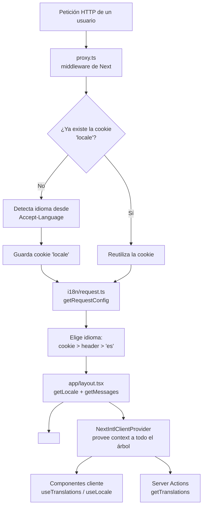
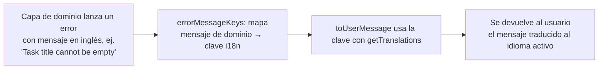

# Internacionalización (i18n) en Clean Task App

Esta guía explica, de forma auto-contenida y paso a paso, cómo está integrada la internacionalización (i18n) en el proyecto para que cualquier persona nueva pueda entenderla y trabajar con ella sin conocimientos previos.

## 1. Resumen

La aplicación usa la librería **next-intl** (v4.x) encima de **Next.js App Router**.

La decisión de arquitectura más importante es que **NO se usan URLs por idioma** (es decir, no hay rutas `/es`, `/en`, etc., como en la mayoría de ejemplos de next-intl). En su lugar, el idioma se **detecta automáticamente** según el navegador del usuario y se **recuerda en una cookie**.

| Característica | Valor |
| --- | --- |
| Librería | `next-intl` (`^4.14.2`) |
| Idiomas soportados | Español (`es`, por defecto) e Inglés (`en`) |
| Idioma por defecto | `es` |
| Estrategia de ruta | Sin rutas por idioma (locale invisible en la URL) |
| Persistencia | Cookie llamada `locale` |
| Detección inicial | Header `Accept-Language` del navegador |

## 2. Diagrama general del flujo



## 3. Resumen de archivos involucrados

| Archivo | Rol | Pieza clave |
| --- | --- | --- |
| `next.config.ts` | Activa el plugin de next-intl en Next.js | `createNextIntlPlugin()` |
| `src/proxy.ts` | Middleware: detecta y guarda la cookie `locale` en la primera visita | `response.cookies.set('locale', ...)` |
| `src/i18n/routing.ts` | Define idiomas, tipos y utilidades de detección | `detectLocale()` |
| `src/i18n/request.ts` | Resuelve, por cada petición, qué idioma usar y qué mensajes cargar | `getRequestConfig()` |
| `src/i18n/messages/es.json` | Traducciones en español (esquema de referencia para el tipado) | claves anidadas |
| `src/i18n/messages/en.json` | Traducciones en inglés (misma estructura que `es.json`) | claves anidadas |
| `src/i18n/messages/schema.ts` | Tipado global de los mensajes en TypeScript | `AppConfig.Messages` |
| `src/app/layout.tsx` | Provee el locale y los mensajes a todos los componentes | `NextIntlClientProvider` |
| Componentes cliente | Consumen las traducciones | `useTranslations`, `useLocale` |
| Server Actions | Traducen mensajes y errores del lado del servidor | `getTranslations` |
| `src/test/renderWithTheme.tsx` | Envuelve los tests con next-intl | `NextIntlClientProvider` |

## 4. Explicación archivo por archivo

### 4.1 `next.config.ts` — activación del plugin

```ts
import createNextIntlPlugin from 'next-intl/plugin'
const withNextIntl = createNextIntlPlugin()

export default withNextIntl(nextConfig)
```

El plugin de next-intl engancha la biblioteca en Next.js. Con la configuración por defecto, busca automáticamente la función `getRequestConfig` exportada desde el archivo por convención **`src/i18n/request.ts`**.

### 4.2 `src/proxy.ts` — el middleware (primera puerta)

```ts
export function proxy(request: NextRequest) {
  const cookieStore = request.cookies
  if (cookieStore.has(LOCALE_COOKIE)) {
    return NextResponse.next()          // ya hay idioma elegido → no hace nada
  }

  const locale = detectLocale(request.headers.get('accept-language'))
  const response = NextResponse.next()
  response.cookies.set(LOCALE_COOKIE, locale, {   // guarda el idioma en cookie
    path: '/',
    sameSite: 'lax',
    maxAge: 60 * 60 * 24 * 365,          // 1 año
  })
  return response
}
```

- Es un **middleware de Next.js** que se ejecuta en cada petición entrante **antes** de renderizar.
- Si el usuario **ya tiene** la cookie `locale`, no hace nada (las peticiones siguientes van directas).
- Si **no la tiene** (primera visita), lee el header `Accept-Language` del navegador, detecta el idioma y lo **persiste en una cookie** que durará un año.
- El `matcher` al final excluye rutas que no necesitan i18n (`api`, `_next`, imágenes, favicon, etc.).

> La cookie `locale` se crea en `src/proxy.ts`, pero quien realmente **decide** el idioma en cada request es `request.ts` (ver 4.6).

### 4.3 `src/i18n/routing.ts` — fuente de la verdad de los idiomas

```ts
export const defaultLocale = 'es'
export const locales = ['es', 'en'] as const
export type Locale = (typeof locales)[number]          // 'es' | 'en'

export function isLocale(value: string | undefined): value is Locale { ... }

export function detectLocale(acceptLanguage?: string | null): Locale {
  if (!acceptLanguage) return defaultLocale
  const accepted = acceptLanguage
    .split(',')
    .map((part) => part.split(';')[0].trim().toLowerCase())
    .find((lang) => isLocale(lang))
  return accepted ?? defaultLocale
}
```

Define:
- `defaultLocale` → el idioma por defecto (`es`).
- `locales` → la lista de idiomas soportados.
- `Locale` → el tipo de TypeScript con los valores posibles.
- `isLocale()` → valida si un string es un idioma soportado (guarda de tipo).
- `detectLocale()` → convierte el header `Accept-Language` en un idioma válido, quedándose con el **primer idioma soportado** que encuentre (o el default si no hay ninguno).

### 4.4 `src/i18n/messages/es.json` y `en.json` — las traducciones

Cada idioma tiene su archivo JSON con **la misma estructura de claves anidadas**:

```json
// es.json
{
  "app": { "name": "Clean Task" },
  "tasks": {
    "create": {
      "title": "Nueva tarea",
      "button": "Nueva tarea",
      "titleField": "Título"
    }
  },
  "messages": { "taskCreated": "Tarea creada" }
}
```

```json
// en.json (misma estructura, textos en inglés)
{
  "app": { "name": "Clean Task" },
  "tasks": {
    "create": {
      "title": "New task",
      "button": "New task",
      "titleField": "Title"
    }
  },
  "messages": { "taskCreated": "Task created" }
}
```

Las claves son rutas anidadas que luego se acceden con puntos: `tasks.create.title`, `messages.taskCreated`, etc.

### 4.5 `src/i18n/messages/schema.ts` — tipado de los mensajes

```ts
import type es from '@/i18n/messages/es.json'

declare global {
  interface AppConfig {
    Messages: typeof es
  }
}
```

- Toma **`es.json` como esquema de referencia** (`typeof es`) y expone el tipo global `AppConfig.Messages`.
- next-intl recoge esta interfaz global automáticamente.
- Como `en.json` debe tener la misma estructura que `es.json`, **TypeScript detecta en tiempo de compilación** si falta una traducción o si escribes mal una clave.

### 4.6 `src/i18n/request.ts` — resolución del idioma por petición

```ts
export const LOCALE_COOKIE = 'locale'

export default getRequestConfig(async () => {
  const cookieStore = await cookies()
  const headerStore = await headers()

  const cookieLocale = cookieStore.get(LOCALE_COOKIE)?.value
  const locale = isLocale(cookieLocale)
    ? cookieLocale
    : detectLocale(headerStore.get('accept-language'))

  return {
    locale,
    defaultLocale,
    messages: (await import(`./messages/${locale}.json`)).default,
  }
})
```

- `getRequestConfig` es la función que necesita next-intl por cada request y lo que el plugin busca por convención.
- **Prioridad del idioma:**
  1. **Cookie** `locale` (si es un idioma válido).
  2. Header **`Accept-Language`** del navegador.
  3. **Default** (`es`).
- Carga de forma **dinámica solo el archivo de mensajes del idioma actual** (`import('./messages/${locale}.json')`), así no se envía al navegador código de idiomas no usados.

### 4.7 `src/app/layout.tsx` — provee el locale a toda la app

```ts
const locale = await getLocale()        // resuelto por request.ts
const messages = await getMessages()

return (
  <html lang={locale} suppressHydrationWarning>
    ...
    <NextIntlClientProvider locale={locale} messages={messages}>
      {children}
    </NextIntlClientProvider>
```

- `getLocale()` / `getMessages()` (de `next-intl/server`) usan `request.ts` para obtener la configuración resuelta.
- `lang={locale}` en la etiqueta `<html>` mejora la accesibilidad y el SEO (etiqueta de idioma correcta).
- `NextIntlClientProvider` hace disponibles los hooks de traducción en **todos los componentes cliente** sin tener que pasar props manualmente.

## 5. Consumo: cómo se traduce en el código

### 5.1 En componentes cliente (`'use client'`)

Traducción de texto con `useTranslations`:

```tsx
import { useTranslations } from 'next-intl'

function CreateTaskButton() {
  const t = useTranslations('tasks.create')   // namespace anidado
  return <button>{t('button')}</button>        // "Nueva tarea" / "New task"
}
```

Formateo de fechas con `useLocale`:

```tsx
import { useLocale } from 'next-intl'

function TaskTable() {
  const locale = useLocale()                    // 'es' o 'en'
  // ...
  {new Date(task.createdAt).toLocaleDateString(locale)}
}
```

### 5.2 En Server Actions / componentes servidor

```ts
import { getTranslations } from 'next-intl/server'

const t = await getTranslations('messages')
t('taskCreated')   // → "Tarea creada" / "Task created"
```

Flujo real en el proyecto (`src/framework/shared/runTaskAction.ts`):



Aquí ocurre un detalle elegante de **arquitectura limpia**: la capa de dominio no conoce nada de i18n (sus mensajes están en inglés "duro"). Es la capa de presentación la que **mapea el error del dominio a una clave de traducción** y la traduce:

```ts
const errorMessageKeys: Record<string, TaskMessageKey> = {
  'Task title cannot be empty': 'titleEmpty',
  'Task description must be at least 10 characters long': 'descriptionTooShort',
  ...
}
```

De este modo el dominio permanece independiente y el usuario siempre ve mensajes en su idioma.

### 5.3 En tests

`src/test/renderWithTheme.tsx` envuelve cada test unitario con el provider de next-intl en español:

```tsx
<NextIntlClientProvider locale='es' messages={es}>
  <ThemeProvider theme={theme}>{children}</ThemeProvider>
</NextIntlClientProvider>
```

También hay un mock de `getTranslations` en `runTaskAction.spec.ts` para los tests de server actions.

## 6. Guía rápida de uso

| Quiero... | Me toca hacer |
| --- | --- |
| Añadir texto nuevo en la UI | Crear la clave en `es.json` y `en.json`, y usarla con `useTranslations('namespace')` en cliente o `getTranslations('namespace')` en servidor. |
| Traducir texto según el idioma en un componente servidor | `getTranslations('clave')`. |
| Traducir en un componente cliente | `useTranslations('clave')` de `next-intl`. |
| Formatear una fecha/importe según el idioma | `useLocale()` y pasarlo a `toLocaleDateString`, etc. |
| Traducir un error lanzado por la capa de dominio | Añadir la entrada en `errorMessageKeys` de `runTaskAction.ts` y su traducción en los JSON. |

## 7. Ves a añadir un idioma nuevo (ej. francés)

1. Crear `src/i18n/messages/fr.json` copiando la estructura de `es.json` y traduciendo los textos.
2. Añadir `'fr'` a `locales` en `src/i18n/routing.ts`.
3. Listo: TypeScript te avisará si algún objeto de `fr.json` no coincide con el esquema de `es.json`.

Al no haber rutas por idioma, **no es necesario** tocar `middleware`, `layout` ni rutas: el nuevo idioma se detectará y servirá automáticamente.

## 8. Añadir un selector de idioma en la interfaz

El sistema ya está preparado: **no hace falta** tocar la lógica de detección. Solo hay que:

1. Crear un componente cliente que, al elegir idioma, **escriba la cookie** `locale` (ej. con `document.cookie = 'locale=fr; path=/'` o un server action) y **recargue** la página (p. ej. `router.refresh()`), para que toda la app se re-renderice con el nuevo idioma.
2. Como la cookie ya la lee `request.ts` y el middleware, el resto del flujo funciona solo.

## 9. Prerrequisitos y puesta en marcha

```bash
pnpm install     # instalar dependencias
pnpm dev         # arrancar el servidor de desarrollo
pnpm test        # ejecutar los tests unitarios
pnpm lint        # ejecutar el linter
```

Documentación oficial de la librería: [next-intl](https://next-intl.dev/).
